<div align="center">

# 🔍 Ledger Lens

**Turn a pile of financial exports into an explainable, queryable, alert-driven picture of what actually happened to your money.**

[](.github/workflows/ci.yml)
[](tsconfig.json)
[](next.config.ts)
[](evidence/lighthouse-summary.txt)
[](evidence/axe-summary.json)
[](evidence/rls-probe.txt)

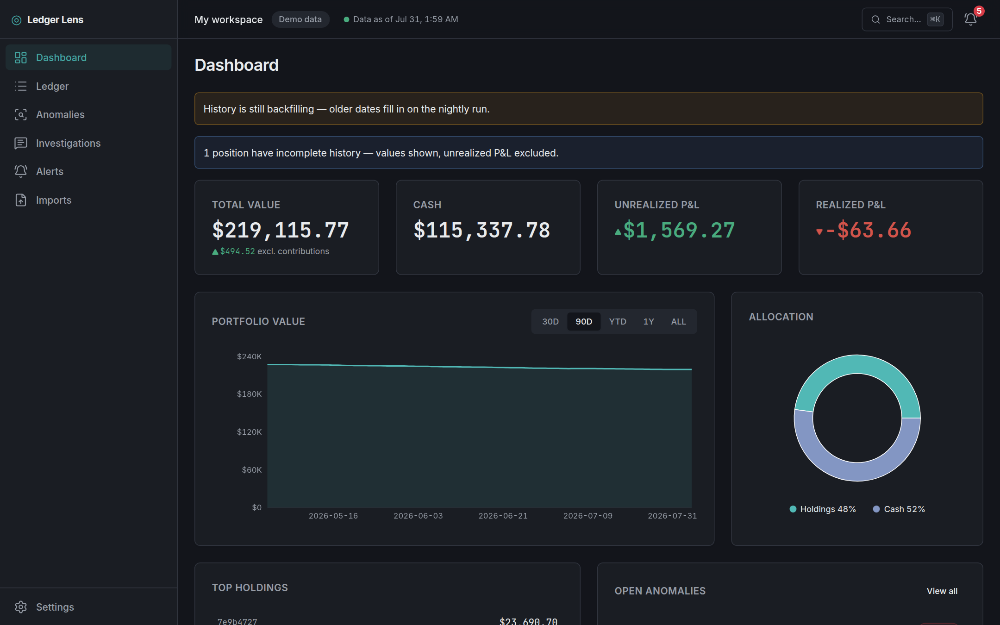

*The dashboard over the deterministic demo workspace — every number below is replayed from an immutable transaction ledger.*

</div>

---

## See it move

| 🧭 Every number opens its evidence | 🤖 AI investigation, streamed live |
| :-: | :-: |
| 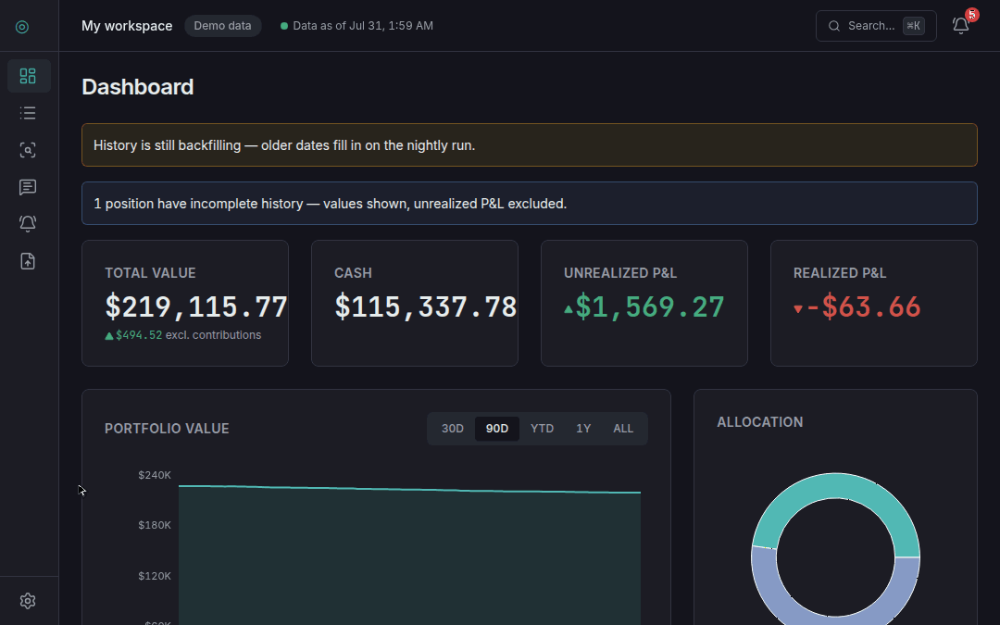 | 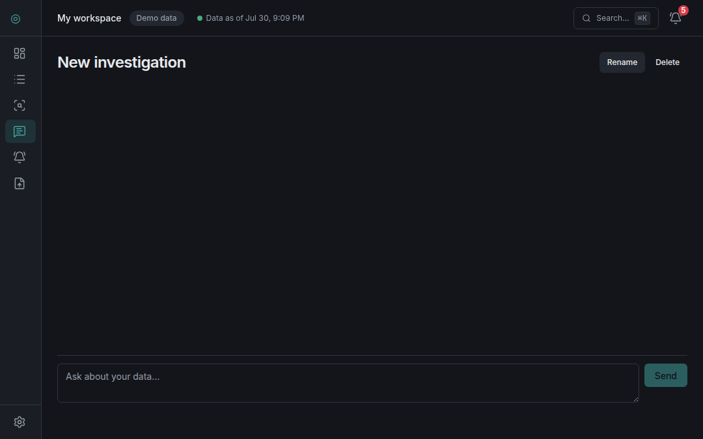 |
| Re-range the chart, then click a headline figure: the **evidence drawer** opens on the exact ledger rows that produced it. No number is a dead end. | Ask, watch the tools run, read the answer — then open a **citation chip**: it was emitted server-side from a real query, so it lands on the 26 rows behind the claim. |

| 📥 CSV → ledger in four steps | 🔎 Search, filter, drill in |
| :-: | :-: |
| 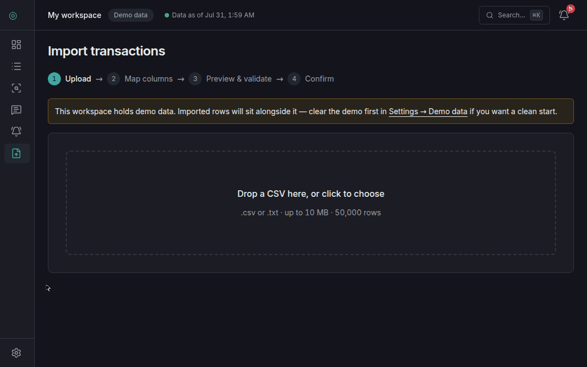 | 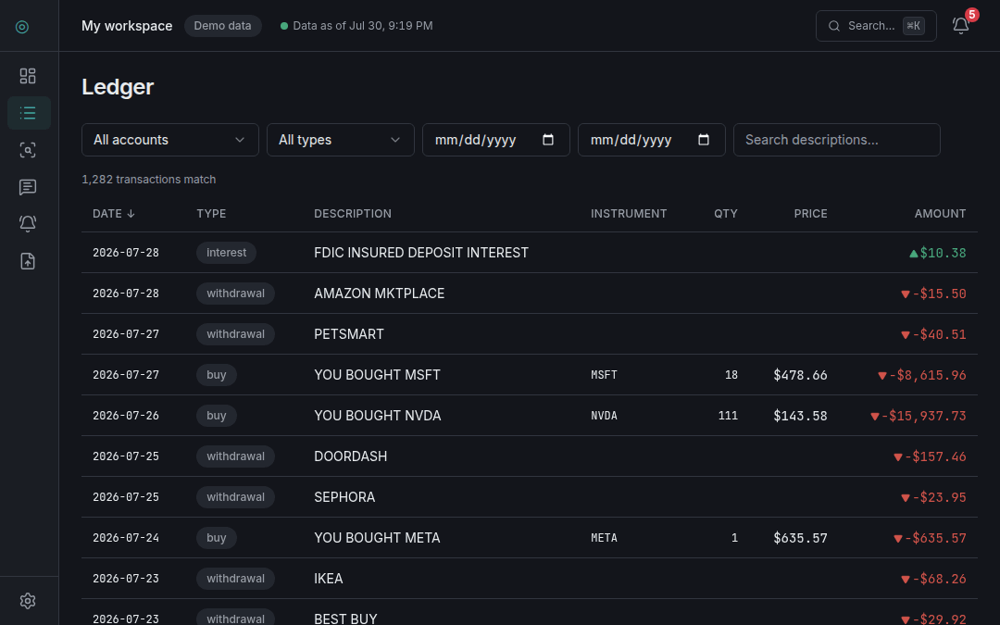 |
| Upload → **auto-mapped columns** → dry-run preview (4 accepted, 1 rejected *with its reason*) → commit to an immutable batch. Nothing lands unpreviewed. | Debounced **full-text search**, typed filters that live in the URL, a live match count, and row expansion revealing each row's import provenance. |

| ↩️ Triage with a real undo | ⌘K everything, light & dark |
| :-: | :-: |
| 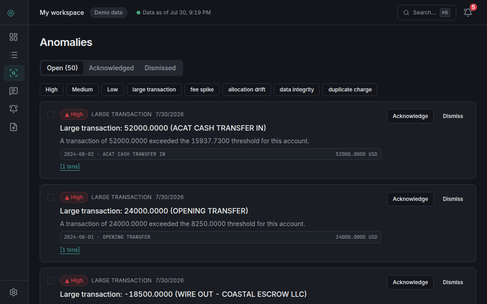 | 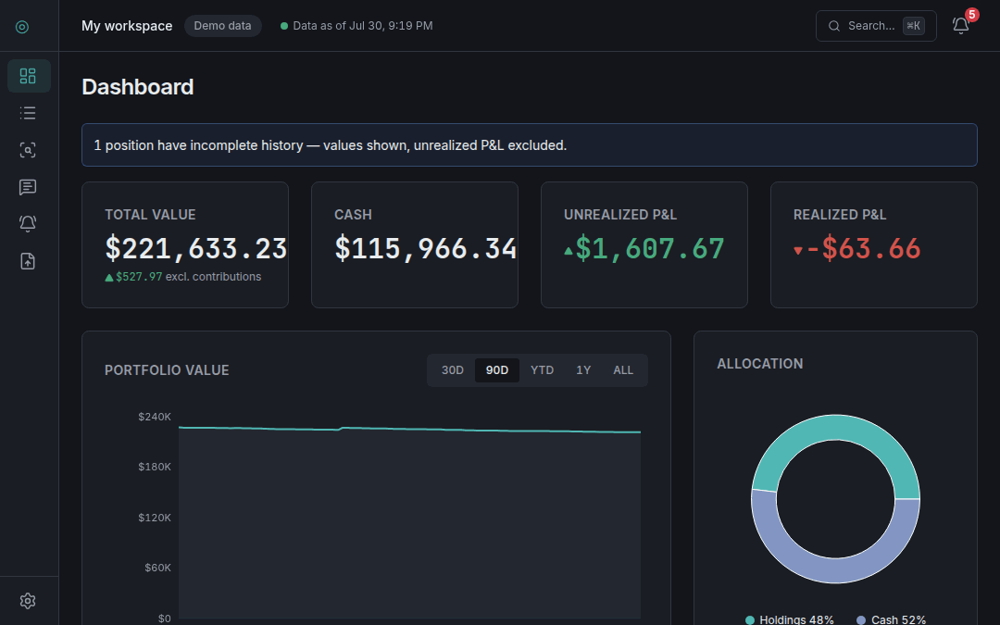 |
| Acknowledge → the card animates out, the queue count ticks down, and a **10-second undo** arms (it pauses while you hover). Undo restores everything. | ⌘K reaches every screen, account, and recent investigation — then flips **dark ↔ light** without touching the mouse. |

---

## What it is

Ledger Lens ingests CSV exports from brokers and banks, replays them into a
deterministic portfolio engine, runs six anomaly detectors over the result,
and lets you interrogate all of it — with an AI investigator whose every
figure is grounded in a cited database query.

| | |
| --- | --- |
| **📥 Import pipeline** — column auto-mapping, dry-run preview, a three-layer duplicate policy, idempotent commits, and a downloadable rejects CSV. Hardened against oversize files, encoding hostility, and spreadsheet formula injection (40-file adversarial corpus in CI). | 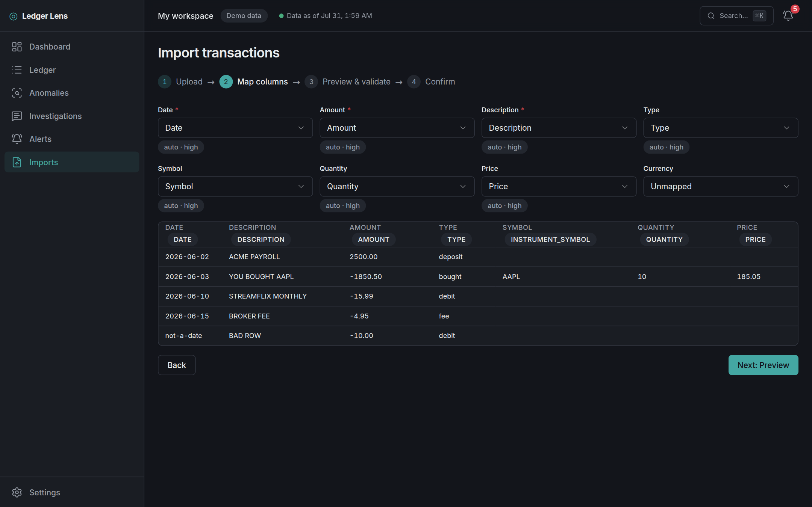 |
| **📒 Immutable ledger** — transactions are never mutated (enforced by Postgres column-level grants, not convention); corrections supersede. Full-text search, URL-held filters, keyboard-driven row expansion. | 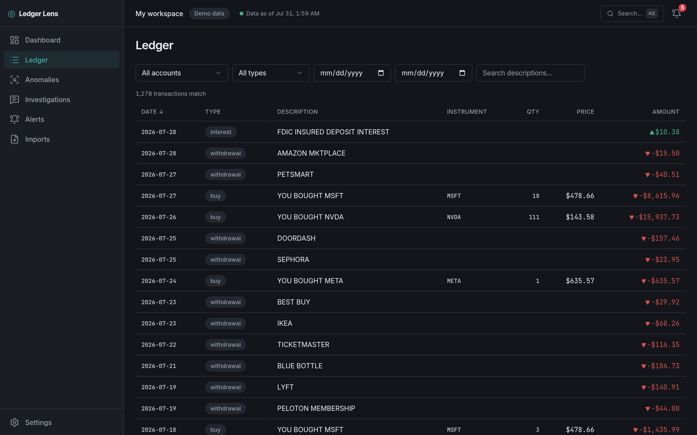 |
| **⚠️ Detection** — six detectors (duplicate charges, fee spikes, price outliers, allocation drift, dormancy wakes, missing-history gaps) with evidence-hash dedup so re-runs never re-alert. The demo seed plants one finding per detector, and CI asserts each one fires. | 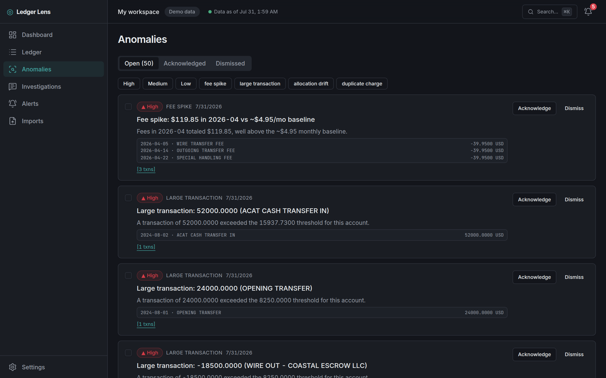 |
| **🤖 AI investigator** — six read-only tools, an SSE tool-calling loop, server-side citations, a circuit breaker, and a 30-case eval suite (grounding, refusal, prompt-injection). The model narrates; **the database answers**. | 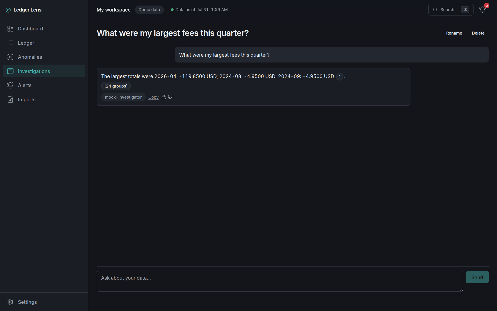 |

<div align="center">
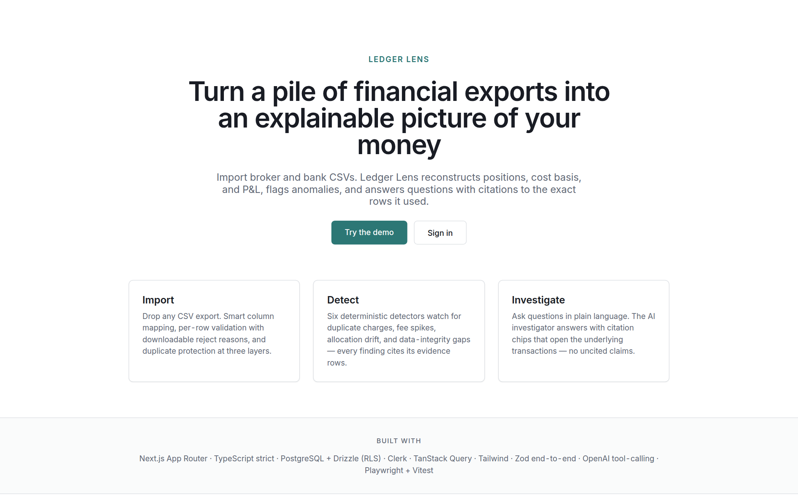


*Tokenized design system — every color, radius, and motion value is a CSS variable; light and dark are the same components.*

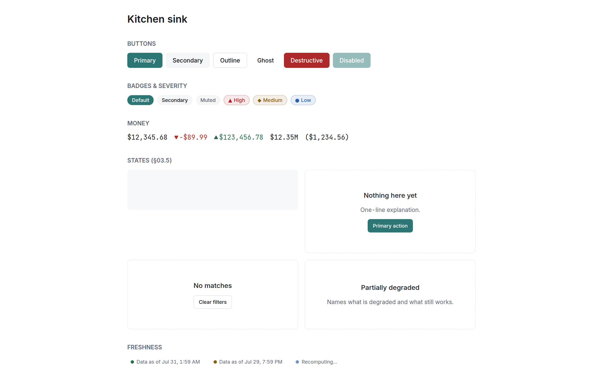

*The kitchen sink renders every component state on one page — it's axe-audited in CI, so a contrast or ARIA regression fails the build before a reviewer ever sees it.*
</div>

---

## Architecture

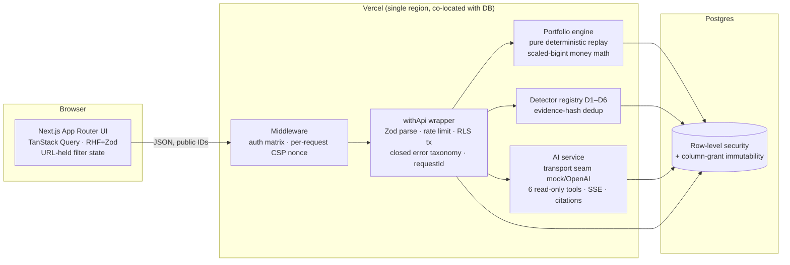

The load-bearing decisions, and why:

- **Deterministic replay over stored balances.** Positions, P&L, and snapshots
  are pure functions of the ledger — recompute from scratch, byte-stable, at
  any date. Golden fixtures pin the engine; a seed change without regenerated
  goldens fails CI.
- **Money as scaled bigints** (×10⁴ currency, ×10⁸ quantity) end-to-end.
  No IEEE 754 drift, property-tested invariants, formatting only at the edge.
- **RLS as defense-in-depth, not the only wall.** The workspace is derived
  server-side from the verified session; RLS + column grants sit underneath so
  an application bug degrades to *zero rows*, not cross-tenant data. The
  silence itself is monitored (`rls_zero_rows`).
- **One API composition point.** Every route goes through `withApi`: Zod
  parsing, rate limits, the RLS transaction, a closed error-code enum, and a
  `requestId` that threads through logs, Sentry tags, and user-facing error
  references.
- **The AI cannot write.** Tool ceiling is read-only queries; prompt injection
  in a hostile transaction description can at worst produce wrong prose —
  which citations and the eval suite exist to surface.
- **Spec-first, single deployable, no monorepo.** A 27-section spec governs
  the build; PROGRESS.md and DECISIONS.md record the milestone state machine
  and every judgment call made along the way.

## Stack

| Layer | Choice | Why |
| --- | --- | --- |
| Framework | Next.js 15 App Router, React 19 | Server components for the shell, dynamic islands (Recharts) for the heavy bits |
| Language | TypeScript `strict` + `noUncheckedIndexedAccess` + `exactOptionalPropertyTypes` | The compiler is the first test suite |
| Data | Drizzle ORM + postgres.js on Supabase-shaped Postgres | SQL-first migrations, RLS, column grants — the database enforces the rules |
| Validation | Zod at every boundary, schemas shared client/server | One source of truth for wire shapes; contract tests generated from the same inventory |
| State | TanStack Query + URL state | Server cache with a typed key factory + invalidation map; filters are shareable links |
| Auth | Clerk (keyless-aware) | Session verification in middleware; webhooks Svix-verified |
| AI | Transport seam: deterministic mock ⇄ OpenAI | The entire pipeline — tools, citations, refusals, evals — runs and CI-gates without an API key |
| Styling | Tailwind + CSS-variable tokens, shadcn-style vendored primitives | Owned code over black-box deps; kitchen-sink page renders every state |
| Testing | Vitest (unit/property/integration/contract/eval) + Playwright (journeys/axe/keyboard/headers/perf/hydration) | 320+ tests across eight suites, all blocking |

## Verification is the feature

The pipeline (`.github/workflows/ci.yml`) mirrors §23.5 of the spec — eight
blocking stages from lint to Lighthouse:

```
install → lint + typecheck → unit + property + contract
                           → integration vs Postgres      → build + bundle budgets
                                                          → E2E + axe + keyboard + hydration
                                                          → Lighthouse CI          → merge gate
```

Measured on this build (committed in [`evidence/`](evidence/)):

| Gate | Budget | Measured |
| --- | --- | --- |
| Dashboard LCP | < 2.5 s | **0.76 s** (median of 3) |
| CLS | < 0.02 | **0.001** |
| Performance score | ≥ 90 | **92–100** per route |
| First-load JS `/` | ≤ 130 KB gz | **103.8 KB** (80%) |
| First-load JS `/app/ledger` | ≤ 200 KB gz | **191.6 KB** (96%) |
| Shared baseline JS | ≤ 110 KB gz | **100.3 KB** |
| Ledger filter round-trip @ 50k rows | < 500 ms p95 | **452 ms** (net of fixed 300 ms debounce) |
| Snapshot recompute @ 50k rows | < 20 s | **~13 s** (366-day backfill) |
| Statement timeout | 5 s enforced | **pg_sleep(6) killed** |
| axe serious/critical | 0 across 10 screens | **0** |
| Cross-tenant probes | all denied | **11/11** |

Some things that make this build unusual:

- **Contract tests are generated** from the same endpoint inventory that
  produces the OpenAPI doc at [`/api/docs`](src/app/api/docs) — 90 assertions
  that every route's envelope, status codes, and auth behavior match the spec.
- **A strict CSP that provably doesn't break the app.** Per-request nonce +
  `strict-dynamic`, no `unsafe-inline` in `script-src` — and a Playwright spec
  that fails on any CSP console violation, because a policy that blocks your
  own scripts passes header-only checks while silently killing hydration.
- **The demo is a test fixture.** One deterministic generator (fixed PRNG)
  produces ~1,300 transactions with one planted finding per detector; E2E
  golden assertions depend on byte-stability across clean runs.
- **PII never reaches the logs** — structured JSON lines with a closed event
  vocabulary, key-path redaction backstop, and a Sentry scrub that is
  deny-by-default; all unit-tested with synthetic PII.

## Run it

```bash
pnpm install
# Postgres 16 with a `ledger_lens` database, then:
pnpm db:migrate && pnpm db:seed     # deterministic demo workspace
pnpm dev                            # http://localhost:3000

pnpm verify:all                     # typecheck + lint + tests + build
pnpm e2e                            # journeys, axe, headers, hydration (prod build)
pnpm eval                           # 29 AI eval cases (mock transport)
node scripts/lighthouse-ci.mjs      # §20.8 assertions against a local prod build
```

Environment is a typed module (`src/server/env.ts`) — the full variable
inventory with purposes lives in the spec's §23.4 table; nothing is required
for local demo mode (`OPENAI_API_KEY=MOCK`, keyless auth, fail-open limits).

## Status

**MVP complete** per the spec's own checkable definition (§25.7): every rubric
gate green; per-section acceptance criteria passing (CI-enforced ones on the
pipeline, manual ones recorded in [`docs/launch-checklist.md`](docs/launch-checklist.md));
zero open P1s; no flaky-tagged tests. Items requiring live credentials
(Vercel deploy, real OpenAI smoke, Sentry DSN, screen-reader walkthroughs)
are tracked as explicit operator gaps in the launch checklist — chosen,
not missed.

Build history: [`PROGRESS.md`](PROGRESS.md) (milestones M0–M9 with per-section
audits) · [`DECISIONS.md`](DECISIONS.md) (every ambiguity resolution, append-only)
· [`CHANGELOG.md`](CHANGELOG.md).

## Security non-goals (stated honestly)

> No SOC 2 or formal compliance program; no encryption-at-rest beyond
> Supabase's provider default; no field-level encryption; no WAF; no
> third-party penetration test; no SLSA/provenance attestations;
> single-maintainer review model (no second-party code review guarantee).
> These are scope decisions for a 20–30 hour portfolio project, listed in the
> README so the evaluator sees them as chosen, not missed.

Sensitive data leaves the system only to OpenAI as part of the analysis
contract, and only when a real key is configured.

**Observability scope (§24.7):** no custom dashboards. The operating surface
is Vercel's function/deploy views, Sentry's issue stream, Supabase's built-in
database stats, and saved log-drain queries for the derived metrics —
Grafana-style dashboards for a single-maintainer portfolio product would be
decoration.

## Free-tier caveats (honest)

> Supabase free tier: no PITR and limited/no automated backup retention —
> mitigated by a nightly pg_dump GitHub Action storing an encrypted artifact
> (30-day retention); this is a real gap versus production-grade posture.
> Free projects pause after inactivity — the daily cron doubles as keep-alive
> for prod; the preview project is woken by CI. Upstash and Vercel free tiers
> cap request volumes — acceptable for portfolio traffic; limits documented
> next to the rate-limit config.

---

<div align="center">
<sub>Built spec-first from a 27-section specification under its autonomous build protocol.<br/>
API reference: <code>/api/docs</code> · Evidence: <a href="evidence/">evidence/</a> · Component gallery: <code>/dev/kitchen-sink</code></sub>
</div>
